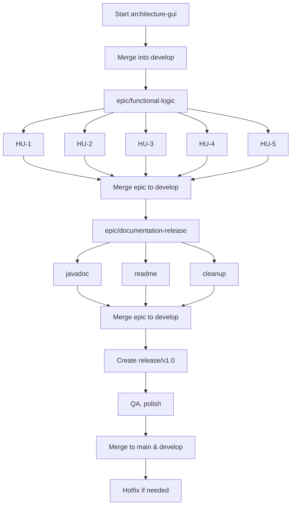

# 🧩 Sudoku Project – Git Workflow Guide

This document defines the professional Git workflow used in the Sudoku 6x6 project. It is designed for a team environment and integrates with task management (e.g., ClickUp).

---

## 🧱 Branch Structure

- `main` – Stable, production-ready branch. Only updated from `release/*`.
- `develop` – Integration branch. All development is merged here before release.
- `release/v1.0` – Final pre-production adjustments and testing.
- `hotfix/*` – Emergency fixes applied directly to `main`.

### 🚀 Epics and Features

- `epic/*` – Represents major phases of development.
- `feature/*` – Each branch represents a task or user story.

---

## 🔄 Development Phases

### ✅ Phase 1 – Architecture Setup
**Branch:** `feature/architecture-gui`

- Objective: Establish JavaFX base with MVC structure.
- Action: Merge into `develop` once completed.

---

### ✅ Phase 2 – Functional Logic
**Branch:** `epic/functional-logic`

Includes:

- `feature/HU-1-interface-design` – Design Sudoku GUI.
- `feature/HU-2-new-game-generator` – Generate valid Sudoku board.
- `feature/HU-3-input-handling` – Enable user input handling.
- `feature/HU-4-input-validation` – Validate Sudoku rules.
- `feature/HU-5-help-functionality` – Implement help/hint feature.

➡️ Merge each `feature/*` into `epic/functional-logic`  
➡️ Then merge the epic into `develop`

---

### ✅ Phase 3 – Documentation & Cleanup
**Branch:** `epic/documentation-release`

Includes:

- `feature/javadoc-completion` – Add documentation to all classes.
- `feature/final-readme` – Finalize `README.md`.
- `feature/folder-cleanup` – Organize project structure.

➡️ Merge all into `epic/documentation-release`, then into `develop`

---

### ✅ Phase 4 – Release

- Create `release/v1.0` from `develop`
- Conduct final QA and review
- Merge into `main` and `develop` when approved

---

### 🧯 Hotfixes

- Branch from `main`
- Example: `hotfix/fix-invalid-input`
- After fixing, merge into `main` and `develop`

---

## 📌 Best Practices

- Never commit directly to `main` or `develop`
- Use clear branch names (prefixes: `feature/`, `epic/`, `hotfix/`)
- Always work via Pull Requests
- Test before merging into any epic or release branch

---

## 🗂️ Visual Workflow

---

## 🧠 Notes

- Each branch correlates with a task in ClickUp.
- Keep commits clean, meaningful, and atomic.
